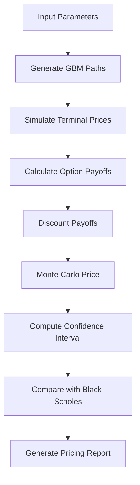
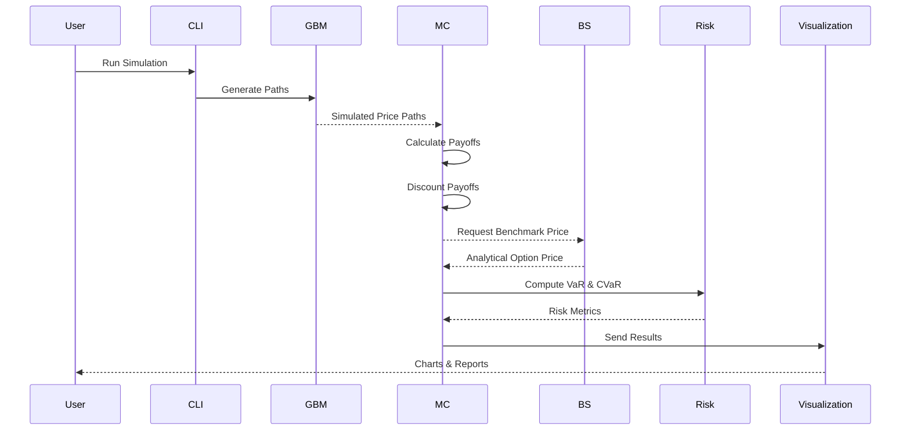
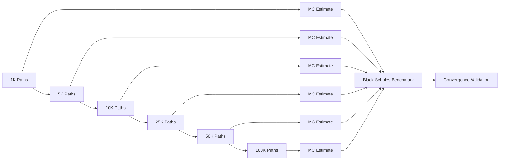
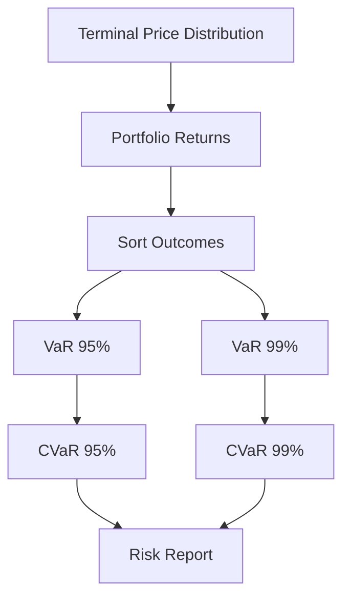
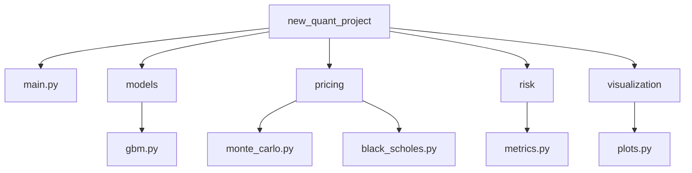

# 🔄 OPTION PRICING WORKFLOW

---

# ⚡ MONTE CARLO PRICING SEQUENCE DIAGRAM

---

# 📊 MONTE CARLO CONVERGENCE DIAGRAM

---

# 📈 RISK ANALYTICS PIPELINE

---

# 📂 PROJECT STRUCTURE ARCHITECTURE

---